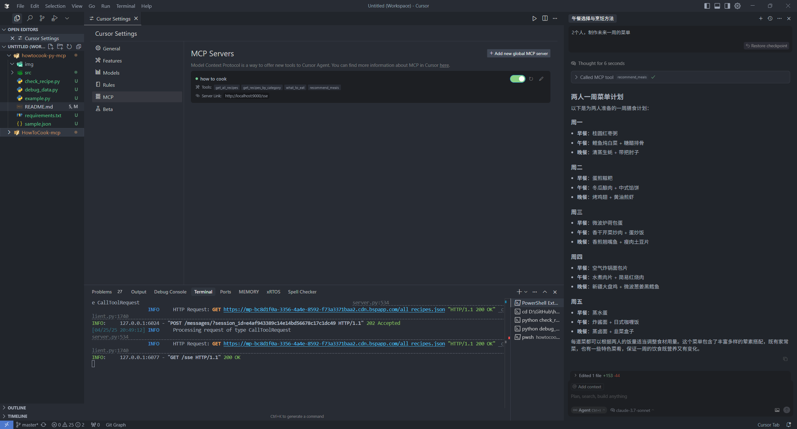

# HowToCook-py-MCP

一个基于 FastMCP 的菜谱推荐服务，支持按分类查菜谱、随机推荐、按人数和忌口生成一周膳食计划。

## 项目功能

- `get_all_recipes`: 获取所有菜谱简化信息（数据量较大，谨慎调用）
- `get_recipes_by_category`: 按分类查询菜谱（如水产、早餐、荤菜、主食）
- `what_to_eat`: 按人数推荐一餐菜品组合
- `recommend_meals`: 按人数、过敏原、忌口生成一周膳食计划和购物清单

## 效果预览



## 目录结构

```text
.
├─ src/
│  ├─ app.py                      # MCP 服务入口（SSE）
│  ├─ data/recipes.py             # 菜谱数据拉取与分类
│  ├─ tools/                      # 工具实现（按模块拆分）
│  ├─ types/models.py             # 数据模型
│  └─ utils/recipe_utils.py       # 菜谱处理工具
├─ scripts/
│  ├─ start_mcp.ps1               # Windows 启动脚本
│  ├─ call_mcp_tool.py            # 直接调用 MCP 工具（推荐）
│  └─ call_mcp_tool.ps1           # PowerShell 调用包装
├─ requirements.txt
└─ README.md
```

## 使用教程

### 1. 环境要求

- Python `3.12+`（建议 3.12 或 3.13）
- 可访问公网（首次会拉取远程菜谱 JSON）

### 2. 安装

获取项目代码

# Windows
python -m venv .venv
.venv\Scripts\activate

# macOS/Linux
# python3 -m venv .venv
# source .venv/bin/activate

pip install -r requirements.txt
```

### 3. 启动 MCP 服务

```bash
python -m src.app
```

服务默认监听 `9000` 端口，SSE 地址为：

- `http://127.0.0.1:9000/sse`

Windows 也可以直接运行：

```powershell
./scripts/start_mcp.ps1
```

### 4. 验证服务是否可用

推荐使用仓库自带的 `scripts/call_mcp_tool.py` 直接调用：

```bash
python scripts/call_mcp_tool.py --tool get_recipes_by_category --arg category=水产
```

如果能返回 JSON，即表示服务工作正常。

### 5. 在 MCP 客户端接入

以 Cursor 为例，在 MCP 配置中添加：

```json
{
  "mcpServers": {
    "how to cook": {
      "url": "http://127.0.0.1:9000/sse"
    }
  }
}
```

接入后可直接用自然语言调用，例如：

- `请使用howtocook-py-mcp的MCP服务为3人晚餐推荐菜单，我对虾过敏`
- `请使用howtocook-py-mcp的MCP服务查询荤菜分类`

## 工具参数说明

### `get_all_recipes`

- 参数：无
- 返回：所有菜谱简化数据（体积较大）

### `get_recipes_by_category`

- 参数：`category`（字符串）
- 示例：`{"category":"水产"}`

### `what_to_eat`

- 参数：`people_count`（整数，建议 1-10）
- 示例：`{"people_count":4}`

### `recommend_meals`

- 参数：
- `people_count`：整数
- `allergies`：字符串数组，如 `["虾", "花生"]`
- `avoid_items`：字符串数组，如 `["香菜", "辣椒"]`
- 示例：

```json
{
  "people_count": 3,
  "allergies": ["虾"],
  "avoid_items": ["辣椒", "香菜"]
}
```

## 部署教程

以下提供两种常见部署方式：单机常驻（Windows）和 systemd 托管（Linux）。

### A. Windows 单机部署（推荐开发/内网）

1. 准备环境并安装依赖（见上文“安装”）
2. 使用脚本启动：

```powershell
./scripts/start_mcp.ps1
```

3. 放行端口（如需局域网访问）：

```powershell
netsh advfirewall firewall add rule name="howtocook-mcp-9000" dir=in action=allow protocol=TCP localport=9000
```

4. 其他机器通过 `http://<你的IP>:9000/sse` 连接

说明：当前服务代码默认端口为 `9000`。如需改端口，请修改 `src/app.py` 中 `FastMCP(..., port=9000)`。

## 运维与排错

- 启动报错 `ModuleNotFoundError`: 检查是否激活了正确虚拟环境并执行过 `pip install -r requirements.txt`
- 返回 `未能获取菜谱数据`: 检查服务器网络是否能访问远程菜谱 JSON
- 客户端连不上：
- 检查服务是否在 `9000` 端口监听
- 检查防火墙是否放行 `9000`
- 检查客户端 URL 是否精确为 `/sse` 结尾
- PowerShell 参数转义复杂时，优先使用 `scripts/call_mcp_tool.py --arg key=value`

## 数据来源

菜谱数据来自远程 JSON：

- `https://mp-bc8d1f0a-3356-4a4e-8592-f73a3371baa2.cdn.bspapp.com/all_recipes.json`

## 许可

MIT License
